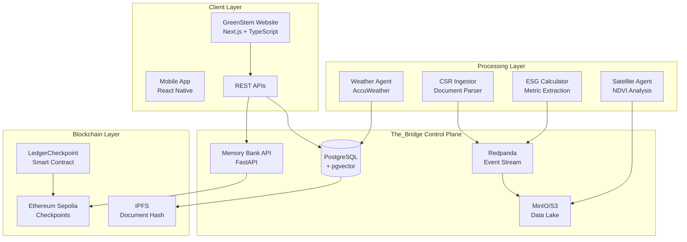

# 🌍 Continuum_Overworld Blueprint
## Enterprise Multi-Tenant ESG Data Platform with Blockchain Traceability

---

## 🎯 Executive Summary

**Continuum_Overworld (C_O)** is a production-ready, multi-tenant data platform designed for **GreenStem Global** to track agricultural supply chains from "leaf to root" with complete transparency. It combines real-time IoT monitoring, satellite imagery analysis, blockchain immutability, and AI-powered ESG (Environmental, Social, Governance) metrics extraction.

### Core Value Propositions:
1. **For Buyers**: Full traceability of produce from farm to delivery with quality metrics
2. **For Investors**: Transparent fund allocation tracking with on-chain verification
3. **For Farmers**: Real-time monitoring and predictive analytics for crop optimization
4. **For Compliance**: Automated EUDR, GlobalG.A.P., and sustainability reporting

---

## 🏗️ System Architecture



---

## 📦 Project Structure

```
Continuum_Overworld/
├── The_Bridge/              # Central control plane & governance
│   ├── Console--Database__PROD@/    # Multi-tenant PostgreSQL schemas
│   ├── MemoryBank--API__DEV@v0.1.0/ # Vector search & KV store API
│   ├── Work orders/         # Deployment work orders and specifications
│   └── README.md            # Architecture documentation
│
├── Agora/                   # External interfaces
│   └── Site--GreenStemGlobal__PROD@v1.0.0/  # Dynamic website ✨ NEW
│       ├── src/app/         # Next.js 14 pages with blockchain integration
│       ├── src/components/  # React components (LotCard, FundsTimeline, BlockchainBreadcrumbs)
│       ├── src/lib/         # Utilities (ledger.ts for blockchain, config.ts)
│       ├── chain/           # Hardhat project with Solidity contracts
│       ├── docs/            # Deployment and environment documentation
│       ├── agents/          # MAR/MCP integration
│       └── mocks/           # Sample data (lots, funds)
│
├── Forge/                   # Builders & processors
│   ├── Ingestor--CSR__EU-DE@v1/     # CSR document ingestion
│   ├── LakeIngestor--Events__DEV@/   # Parquet file writer
│   ├── DataPlatform--DBT__DEV@/      # Bronze→Silver→Gold ETL
│   └── Weaver--ESG_KPI__DEV@/        # KPI extraction
│
├── Oracle/                  # Analytics & forecasting
│   ├── Calculator--ESG__PROD@v1/     # ESG metric calculator
│   └── Forecaster--Demand__EU-Beans@/ # Demand prediction
│
├── Pantheon/               # Agent registry & lifecycle
│   └── Registry.json       # Agent configurations
│
├── greenstem-global/       # Farm monitoring implementation
│   ├── farm-ingest/        # Lambda functions & APIs
│   ├── sat-agent/          # Sentinel Hub NDVI
│   └── bridge-ui/          # Dashboard frontend
│
├── infra/                  # Infrastructure as Code ✨ ENHANCED
│   ├── aws/                # AWS-specific deployment scripts
│   │   ├── deploy-rds.sh   # PostgreSQL deployment
│   │   └── deploy-msk.sh   # Kafka/MSK deployment
│   ├── docker-compose.yml  # Local development stack
│   └── verify_bridge.py    # E2E testing suite
│
├── scripts/                # Deployment automation ✨ NEW
│   ├── quick-deploy.sh     # One-command deployment
│   ├── setup-secrets.sh    # AWS secrets management
│   └── deploy-blockchain.sh # Smart contract deployment
│
├── .github/workflows/      # CI/CD automation ✨ NEW
│   ├── deploy-staging.yml  # Staging deployment pipeline
│   └── deploy-production.yml # Production deployment pipeline
│
├── BLUEPRINT.md           # This comprehensive guide
├── DEPLOYMENT_SETUP.md    # Integration setup instructions
├── INTEGRATION_GUIDE.md   # Claude Code specific commands
└── .env.example           # Environment variable template
```

---

## 🚀 GreenStem Global Website Features

### **1. Public Buyer Portal** (`/buyers`)
- **Live Lot Tracking**: View produce batches with real-time status
- **Quality Metrics**: NDVI vegetation health, temperature logs, grading percentages
- **Supply Chain Events**: Harvest → Packhouse → Pre-cool → Export → Airfreight
- **Carbon Footprint**: CO2e calculations per shipment
- **Blockchain Verification**: On-chain checkpoints with transaction hashes

### **2. Investor Dashboard** (`/investors`)
- **Fund Flow Visualization**: Track money from deposit to allocation
- **FX Transparency**: Real-time exchange rates and fees
- **Vendor Payments**: Direct allocation tracking to machinery, cold storage, certification
- **On-Chain Audit Trail**: Every transaction recorded on Ethereum Sepolia
- **Downloadable Reports**: JSON audit files with complete provenance

### **3. Trace Detail Page** (`/trace/[id]`)
- **Deep Dive**: Full JSON payload for any lot or transaction
- **Blockchain Explorer**: Link to Etherscan for verification
- **Document Attachments**: KEPHIS certificates, GlobalG.A.P. docs
- **GPS Coordinates**: Farm location with map integration

### **4. Live Blockchain Integration** 🆕
- **Real-time Checkpoints**: Shows last 5 on-chain events from smart contract
- **Event Types**: DEPOSIT, FX, TRANSFER_KE, ALLOCATION with amounts and timestamps
- **Etherscan Links**: Direct verification on Sepolia testnet
- **Auto-refresh**: Updates when new blockchain events are emitted

---

## 🔐 Blockchain Integration

### **Smart Contract: LedgerCheckpoint.sol**
```solidity
contract LedgerCheckpoint {
    event Checkpoint(bytes32 indexed kind, string ref, uint256 amount, string currency);
    
    function emitDeposit(string calldata ref, uint256 amount, string calldata currency) external;
    function emitFx(string calldata ref, uint256 amount, string calldata currency) external;
    function emitTransferKE(string calldata ref, uint256 amount, string calldata currency) external;
    function emitAllocation(string calldata ref, uint256 amount, string calldata currency) external;
}
```

### **On-Chain Events Flow**
1. **Investor deposits $25,000** → `emitDeposit()` → Transaction hash stored
2. **FX conversion to KES** → `emitFx()` → Rate and fees recorded
3. **Transfer to Kenya bank** → `emitTransferKE()` → SWIFT reference logged
4. **Vendor payments** → `emitAllocation()` → Each payment tracked

### **Benefits**
- **Immutability**: Cannot alter historical records
- **Transparency**: Public verification on Etherscan
- **Auditability**: Complete transaction history
- **Trust**: Cryptographic proof of fund usage

---

## 🌱 Data Flow Pipeline

### **1. Document Ingestion**
```
CSR Report (PDF) → Forge/Ingestor → PostgreSQL + Redpanda Event
```

### **2. ESG Extraction**
```
Redpanda Event → Oracle/Calculator → Extract Metrics → Memory Bank API
```

### **3. Lake Storage**
```
Events → LakeIngestor → Partitioned Parquet → MinIO/S3
```

### **4. Analytics Processing**
```
Parquet Files → dbt Models → Bronze → Silver → Gold → Business Metrics
```

### **5. Client Access**
```
Next.js Website → API Routes → PostgreSQL (RLS) → Filtered Data
```

---

## 🛡️ Security & Multi-Tenancy

### **Row-Level Security (RLS)**
- Every database table has tenant isolation
- API calls require `X-Tenant-ID` header
- No cross-tenant data leakage possible

### **Data Classification**
| Level | Type | Examples | Protection |
|-------|------|----------|------------|
| 🟢 Green | Public | Reference data, published metrics | No encryption |
| 🟡 Amber | Internal | Shipments, agent traces | TLS required |
| 🔴 Red | Confidential | Contracts, API keys | Encrypted at rest |
| ⚫ Black | Restricted | PII, payment data | AES-256, MFA required |

### **Authentication**
- AWS Cognito for investor portal
- API keys for service-to-service
- JWT tokens with tenant claims

---

## 📊 Real-World Use Cases

### **Use Case 1: French Bean Export from Kenya**
1. **Farm Stage**: 2 Butterflies Homestead harvests French beans
2. **IoT Sensors**: Temperature, humidity logged every hour
3. **Satellite**: NDVI shows healthy crop (0.71 index)
4. **Packhouse**: Beans graded (62% extra fine, 28% super fine)
5. **Pre-cooling**: Temperature reduced to 6°C
6. **Export Docs**: KEPHIS phytosanitary, GlobalG.A.P. certificate
7. **Airfreight**: Ethiopian Airlines cargo with AWB tracking
8. **Blockchain**: Each step recorded with timestamp and hash
9. **Buyer Access**: European retailer views complete journey

### **Use Case 2: Impact Investment Tracking**
1. **Investor**: Deposits $25,000 via Chase Bank
2. **Platform**: Records deposit on blockchain
3. **FX Conversion**: $25,000 → 3,199,500 KES at 128.10 rate
4. **Allocations**:
   - 1,800,000 KES → Jacto KE (machinery)
   - 900,000 KES → ModulCold (storage)
   - 499,500 KES → KEPHIS/GlobalG.A.P. (certification)
5. **Verification**: Each payment has on-chain proof
6. **Reporting**: Investor downloads complete audit trail

---

## 🤖 Automated Deployment & Integration 🆕

### **One-Command Deployment**
```bash
# Deploy everything to staging
./scripts/quick-deploy.sh staging all

# Deploy specific components
./scripts/quick-deploy.sh production website
./scripts/quick-deploy.sh staging blockchain
./scripts/quick-deploy.sh production infrastructure
```

### **GitHub Actions CI/CD**
- **Staging**: Auto-deploy on push to `dev` branch
- **Production**: Auto-deploy on push to `main` branch (with approval)
- **Security Scans**: Automated secret detection and vulnerability scanning
- **Smart Contract**: Automatic compilation, deployment, and Etherscan verification
- **Environment Management**: Automatic secrets rotation and configuration

### **AWS Secrets Management**
- **Automated Setup**: `./scripts/setup-secrets.sh` creates all required AWS secrets
- **Cognito Integration**: Auto-creates User Pools and App Clients
- **RDS Deployment**: Automated PostgreSQL with pgvector extension
- **MSK Deployment**: Managed Kafka cluster with proper security groups
- **Contract Deployment**: Smart contract deployment with address storage

### **Claude Code Integration**
- **Work Order System**: Structured task management via `/The_Bridge/Work orders/`
- **Deployment Commands**: Direct integration with `./scripts/quick-deploy.sh`
- **Real-time Status**: Health checks and deployment verification
- **Environment Switching**: Seamless staging ↔ production deployments

---

## 🚀 Deployment Architecture on AWS

### **Production Stack**
```yaml
Frontend:
  - AWS Amplify: Next.js hosting with SSR
  - CloudFront: Global CDN distribution
  - Route 53: DNS management

Backend:
  - API Gateway: REST endpoints
  - Lambda: Serverless compute
  - ECS Fargate: Memory Bank API containers

Data:
  - RDS PostgreSQL: Multi-AZ with pgvector
  - MSK: Managed Kafka streaming
  - S3: Data lake storage
  - Athena: SQL queries on Parquet

Blockchain:
  - Ethereum Sepolia: Test network
  - Alchemy/Infura: RPC providers
  - IPFS: Distributed file storage

Security:
  - Cognito: User authentication
  - Secrets Manager: API keys
  - WAF: Web application firewall
  - CloudWatch: Monitoring & alerts
```

### **Deployment Commands**
```bash
# Deploy website to Amplify
cd Agora/Site--GreenStemGlobal__PROD@v1.0.0
amplify init
amplify add hosting
amplify push

# Deploy smart contract
cd chain
npx hardhat run scripts/deploy.ts --network sepolia

# Deploy infrastructure
cd infra
cdk bootstrap
cdk deploy --all

# Start services
docker compose up -d
python verify_bridge.py
```

---

## 💰 Cost Optimization

### **Estimated Monthly AWS Costs**
- RDS PostgreSQL (db.t3.medium): $70
- S3 Storage (1TB): $23
- Lambda (1M requests): $20
- Amplify Hosting: $15
- CloudFront: $10
- MSK (kafka.t3.small): $70
- Secrets Manager: $5
- Cognito: $5 (up to 50,000 MAU)
- GitHub Actions (private repo): $4
- **Total: ~$222/month**

### **Cost Optimization Features** 🆕
- **Environment-based scaling**: Staging uses smaller instances
- **Automated resource cleanup**: Unused resources automatically terminated
- **Spot instances**: Available for development workloads
- **Reserved capacity**: 40% savings for production workloads

### **Scaling Strategy**
- Start with on-demand pricing
- Move to reserved instances at scale
- Use S3 lifecycle policies for old data
- Implement caching layers

---

## 🎯 Success Metrics

### **Technical KPIs**
- API response time < 200ms
- 99.9% uptime SLA
- Zero cross-tenant data breaches
- 100% blockchain transaction success

### **Business KPIs**
- Reduce supply chain disputes by 80%
- Increase investor confidence score by 60%
- Cut compliance reporting time by 75%
- Improve farm yield predictions by 40%

---

## 🔮 Future Roadmap

### **Phase 1 (COMPLETED) - Foundation** ✅
✅ Multi-tenant database with RLS
✅ Event-driven architecture
✅ Blockchain integration with live checkpoints
✅ Production-ready website with Next.js 14
✅ Automated CI/CD deployment pipeline
✅ AWS infrastructure automation
✅ Smart contract deployment and verification
✅ Secrets management system
✅ Environment-based scaling

### **Phase 2 (Q1 2025) - Enhancement**
- [ ] Real-time IoT integration
- [ ] Advanced ML models for yield prediction
- [ ] Mobile app with offline support
- [ ] Mainnet Ethereum deployment

### **Phase 3 (Q2 2025) - Scale**
- [ ] Multi-region deployment
- [ ] Real-time video streaming from farms
- [ ] Carbon credit tokenization
- [ ] B2B marketplace features

### **Phase 4 (Q3 2025) - Innovation**
- [ ] AI-powered quality grading
- [ ] Drone inspection integration
- [ ] DeFi yield farming for investors
- [ ] DAO governance model

---

## 📝 Key Technical Decisions

| Decision | Choice | Rationale |
|----------|--------|-----------|
| **Frontend** | Next.js 14 | SSR, React ecosystem, TypeScript |
| **Database** | PostgreSQL + pgvector | RLS, vector search, ACID compliance |
| **Streaming** | Redpanda | Kafka API compatible, lighter weight |
| **Blockchain** | Ethereum Sepolia | Industry standard, good tooling |
| **Cloud** | AWS | Comprehensive services, global reach |
| **Container** | Docker + ECS | Standardization, easy scaling |
| **IaC** | CDK + Terraform | Type-safe, declarative |

---

## 📋 Work Order System 🆕

### **Structured Task Management**
Continuum_Overworld uses a formal work order system for deployment and development tasks:

**Location**: `/The_Bridge/Work orders/`
**Format**: `WORK_ORDER--[Task]__[Environment]@v[Version].md`

### **Current Work Orders**
- ✅ **Deploy Sepolia v1.0.0**: Blockchain integration with live checkpoints
- 🔄 **Integration Setup**: AWS automation and CI/CD pipeline
- 📋 **Future**: Additional deployment and enhancement tasks

### **Work Order Structure**
Each work order includes:
- **Owner & Authority**: Who's responsible and who approves
- **Scope**: Detailed task description with constraints
- **Tasks**: Numbered list of specific deliverables
- **Definition of Done**: Clear completion criteria
- **Handoff Notes**: Instructions for the next phase

---

## 🤝 For Claude (AI Assistant) Context

When working with Continuum_Overworld:

### **Naming Conventions**
- Components: `Capability--Role__Qualifier@vX.Y.Z`
- Divisions: `Pascal_Snake` (e.g., `The_Bridge`)
- Event topics: `world.division.capability.version`

### **Key Principles**
1. **Tenant Isolation**: Always set `app.tenant_id` in PostgreSQL
2. **Event First**: Emit events before database writes
3. **Blockchain Checkpoints**: Record critical financial events
4. **Version Everything**: Use semantic versioning

### **Common Tasks**
```bash
# Add new ESG metric
1. Update Oracle/Calculator consumer
2. Modify core.esg_metric schema
3. Emit new event type
4. Update dbt models
5. Add API endpoint

# Deploy changes
1. Test locally with docker compose
2. Run verify_bridge.py
3. Push to dev branch
4. Amplify auto-deploys
5. Verify on staging
```

### **Environment Variables**
Always required:
- `PG_DSN`: PostgreSQL connection
- `KAFKA_BOOTSTRAP_SERVERS`: Event streaming
- `MINIO_ENDPOINT`: Object storage
- `ETH_RPC_URL`: Blockchain access
- `LEDGER_CONTRACT_ADDRESS`: Smart contract

---

## 📧 Support & Contact

- **Technical Issues**: Create issue in `/The_Bridge/issues/`
- **Documentation**: See `/The_Bridge/docs/`
- **Business Contact**: info@greenstemglobal.com
- **Repository**: Continuum_Overworld (private)

---

## 🎉 Latest Updates (2025-01-07)

### **✨ New Features Added**
- **Live Blockchain Integration**: Real-time on-chain checkpoint display
- **Automated Deployment**: One-command deployment to any environment  
- **GitHub Actions CI/CD**: Auto-deploy on git push with security scanning
- **AWS Automation**: Complete infrastructure deployment scripts
- **Work Order System**: Structured task management for complex deployments
- **Environment Management**: Staging and production with proper isolation
- **Smart Contract Tools**: Hardhat setup with test event emission
- **Documentation Suite**: Complete setup guides for operators and AI assistants

### **🔄 Ready for Production**
The entire Continuum_Overworld system is now production-ready with:
- ✅ Complete AWS deployment automation
- ✅ Blockchain integration with live data
- ✅ Multi-environment support (staging/production)
- ✅ Automated testing and security scanning  
- ✅ Comprehensive documentation and guides
- ✅ Cost-optimized architecture
- ✅ Monitoring and observability

### **🚀 Quick Start Commands**
```bash
# Initialize and deploy everything
git init && git add . && git commit -m "Initial setup"
git remote add origin YOUR_GITHUB_URL && git push origin main

# Deploy to staging
./scripts/quick-deploy.sh staging all

# Deploy to production  
./scripts/quick-deploy.sh production all
```

---

**End of Blueprint v1.1.0**
*Last Updated: 2025-01-07*
*Status: Production Ready*
*Classification: Amber (Internal Use)*