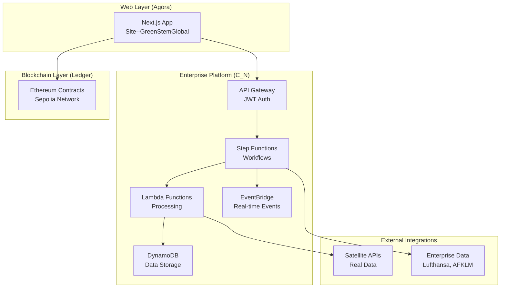
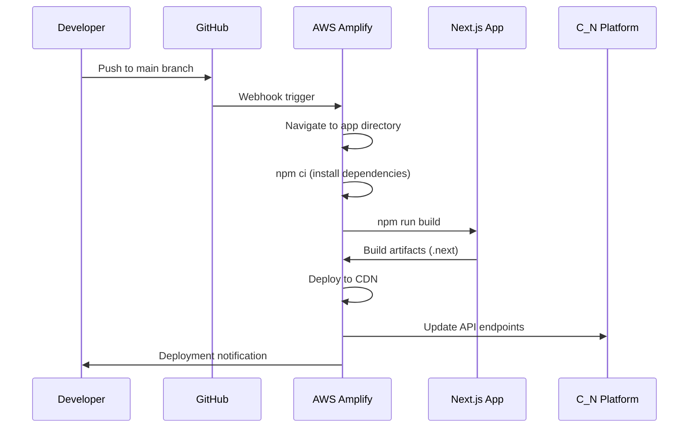

# Technical Specifications - Continuum Overworld Deployment Architecture

## 🎯 Quick Reference for Development Team

### Current Production App
- **App Name**: `Site--GreenStemGlobal__PROD@v1.0.0`
- **Framework**: Next.js 14.2.5 + React 18.3.1 + TypeScript
- **Deployment**: AWS Amplify (App ID: `dgcik29wowtkc`)
- **Status**: ✅ Successfully Deployed and Operational

---

## 🚀 Deployment Configuration Matrix

| Component | Configuration File | Purpose | Critical Settings |
|-----------|-------------------|---------|-------------------|
| **Root Amplify** | `/amplify.yml` | Orchestrates monorepo builds | `cd` to app dir, artifact paths |
| **App Config** | `/Agora/.../package.json` | Next.js dependencies | Build scripts, dependencies |
| **Environment** | `/Agora/.../.env.example` | Runtime configuration | Chain ID, API endpoints |
| **CI/CD** | `/.github/workflows/` | Automated testing | Multi-component pipeline |
| **Git Rules** | `/CONTRIBUTING.md` | Commit guidelines | AWS Amplify YAML compatibility |

---

## 📊 Enterprise Integration Specifications

### C_N Platform Architecture


### Key Integration Points
1. **Web → Platform**: JWT-authenticated API calls through AWS API Gateway
2. **Platform → Blockchain**: Contract interaction via Ethers.js for data anchoring
3. **Platform → External**: Real-time data ingestion from satellite and enterprise APIs
4. **Event Flow**: EventBridge orchestrates real-time processing across all components

---

## 🔧 Technical Stack Specifications

### Frontend Stack (Agora Division)
```json
{
  "framework": "Next.js 14.2.5",
  "runtime": "React 18.3.1",
  "language": "TypeScript 5.5.4",
  "styling": "TailwindCSS 3.4.10",
  "blockchain": "Ethers.js 6.13.2",
  "validation": "Zod 3.23.8",
  "deployment": "AWS Amplify"
}
```

### Backend Stack (C_N Division)
```json
{
  "infrastructure": "AWS CDK (TypeScript)",
  "compute": "AWS Lambda (Node.js 20)",
  "database": "DynamoDB (Pay-per-request)",
  "storage": "S3 (KMS encrypted)",
  "orchestration": "Step Functions",
  "api": "API Gateway (JWT)",
  "events": "EventBridge",
  "monitoring": "X-Ray + CloudWatch"
}
```

### Blockchain Stack (Ledger Division)
```json
{
  "network": "Sepolia Testnet",
  "chainId": 11155111,
  "framework": "Hardhat",
  "language": "Solidity",
  "deployment": "Hardhat Ignition",
  "integration": "Ethers.js v6"
}
```

---

## 🏗️ Directory Structure Specifications

```
Continuum_Overworld/
│
├── 📁 Agora/                           # Web Applications Division
│   └── 📱 Site--GreenStemGlobal__PROD@v1.0.0/
│       ├── 🔧 amplify.yml              # App-specific Amplify config
│       ├── 📦 package.json             # Next.js dependencies
│       ├── 🔐 .env.example            # Environment variables
│       ├── ⚙️  next.config.js          # Next.js configuration
│       ├── 📝 tsconfig.json           # TypeScript configuration
│       ├── 🎨 tailwind.config.ts      # TailwindCSS configuration
│       └── 📁 src/                     # Application source code
│           ├── 📁 app/                 # Next.js App Router
│           ├── 📁 components/          # React components
│           ├── 📁 lib/                 # Utility functions
│           └── 📁 types/               # TypeScript definitions
│
├── 🏢 C_N/                             # Enterprise Platform (Continuum_Nexus)
│   ├── 📁 infrastructure/              # CDK Infrastructure Stacks
│   │   ├── 🏗️  lib/cn-farm-data-stack.ts    # Farm data infrastructure
│   │   ├── 🏗️  lib/cn-satellite-stack.ts    # Satellite processing
│   │   ├── 🏗️  lib/cn-api-stack.ts          # API Gateway + Lambda
│   │   └── 🏗️  lib/cn-monitoring-stack.ts   # Observability
│   └── 📁 lib/                         # Business logic libraries
│       ├── 🔍 lambda/farm-validator/    # Farm geometry validation
│       ├── 🛰️  lambda/satellite-processor/ # Satellite data processing
│       └── 🔄 step-functions/          # Workflow definitions
│
├── ⛓️  Ledger/                          # Blockchain Contracts
│   ├── 📁 contracts/                   # Solidity smart contracts
│   ├── 📁 scripts/                     # Deployment scripts
│   └── 📁 test/                        # Contract tests
│
├── 🎛️  The_Bridge/                      # Control Surface & Governance
│   └── 📁 governance/                  # Policy and access control
│
├── 🛠️  infra/                          # Infrastructure as Code
│   └── 📁 terraform/                   # Additional infrastructure
│
└── ✅ validation/                      # Testing & Quality Assurance
    ├── 📁 integration/                 # Integration tests
    └── 📁 performance/                 # Performance testing
```

---

## 🌐 Network & Security Specifications

### AWS Amplify Configuration
- **App ID**: `dgcik29wowtkc`
- **Region**: `us-east-1`
- **Account**: `086143043656`
- **Build Environment**: Amazon Linux 2
- **Node.js Version**: 20.x
- **Build Timeout**: 30 minutes
- **Cache Strategy**: `node_modules` and build artifacts

### Security Configuration
- **SSL/TLS**: Enforced HTTPS with AWS Certificate Manager
- **IAM Roles**: Separate authenticated/unauthenticated access
- **Environment Variables**: Encrypted storage in Amplify Console
- **CORS**: Configured for production domains only
- **Content Security Policy**: Implemented for XSS protection

### Network Architecture
- **CDN**: AWS CloudFront global distribution
- **Load Balancing**: Automatic across AWS Availability Zones
- **DDoS Protection**: AWS Shield Standard included
- **WAF**: Web Application Firewall for API endpoints

---

## 📈 Performance & Monitoring Specifications

### Application Performance
- **Core Web Vitals**: Optimized for Google Lighthouse scores
- **Bundle Size**: Optimized with Next.js automatic splitting
- **Caching**: Static assets cached for 1 year
- **Image Optimization**: Next.js Image component with WebP/AVIF
- **Database**: DynamoDB with global secondary indexes

### Monitoring & Observability
```json
{
  "application_monitoring": "AWS X-Ray distributed tracing",
  "logs": "CloudWatch Logs with structured JSON",
  "metrics": "CloudWatch custom metrics for business KPIs",
  "alarms": "CloudWatch Alarms for error rates and latency",
  "dashboards": "CloudWatch Dashboards for operational visibility",
  "real_user_monitoring": "Amplify Analytics for user behavior"
}
```

### Performance Targets
- **Page Load Time**: < 2 seconds (75th percentile)
- **API Response Time**: < 500ms (95th percentile)  
- **Availability**: 99.9% uptime SLA
- **Error Rate**: < 0.1% for critical user flows
- **Build Time**: < 5 minutes for full deployment

---

## 💰 Cost Management Specifications

### Current Operational Costs (Monthly)
| Service | Estimated Cost | Optimization Strategy |
|---------|---------------|----------------------|
| **Amplify Hosting** | $15-18 | Build caching, efficient artifacts |
| **DynamoDB** | $2-5 | Pay-per-request, optimized queries |
| **Lambda** | $1-3 | Right-sized memory, efficient code |
| **S3 Storage** | $1-2 | Lifecycle policies, compression |
| **API Gateway** | $1-2 | Caching, request optimization |
| **CloudWatch** | $1-2 | Log retention policies |
| **Total** | **$21-32** | Target: Keep under $30/month |

### Cost Optimization Strategies
1. **Amplify Build Optimization**: Cache dependencies, optimize build time
2. **DynamoDB Efficiency**: Single-table design, optimized access patterns
3. **Lambda Performance**: Optimize memory allocation, reduce cold starts
4. **S3 Lifecycle Management**: Automated archiving and deletion policies
5. **CloudWatch Log Retention**: Automatic cleanup of old logs

---

## 🔄 Deployment Pipeline Specifications

### Automated Deployment Flow


### Build Environment Specifications
```yaml
# Amplify Build Environment
os: Amazon Linux 2
node_version: 20.x
npm_version: 10.x
build_timeout: 1800  # 30 minutes
memory: 7000MB       # 7GB build container
cpu: 4vCPU          # Quad-core processing

# Build Cache Strategy
cache_node_modules: true
cache_next_build: true
cache_validity: 30 days
```

---

## 🔐 Environment Variables Specifications

### Production Environment Variables (Amplify Console)
```bash
# Application Configuration
NEXT_PUBLIC_SITE_ENV=production
NEXT_PUBLIC_BASE_URL=https://your-domain.amplifyapp.com
NEXT_PUBLIC_CHAIN_ID=11155111

# API Endpoints
NEXT_PUBLIC_API_BASE_URL=https://api.your-domain.com
NEXT_PUBLIC_WEBSOCKET_URL=wss://ws.your-domain.com

# Blockchain Configuration
ETH_RPC_URL=https://sepolia.infura.io/v3/YOUR_PROJECT_ID
LEDGER_CONTRACT_ADDRESS=0x1234567890abcdef1234567890abcdef12345678

# AWS Cognito
COGNITO_USER_POOL_ID=us-east-1_ABC123DEF
COGNITO_CLIENT_ID=abcdef123456789
COGNITO_REGION=us-east-1

# External API Keys (Server-side only)
OPENWEATHER_API_KEY=your_openweather_key
SATELLITE_API_KEY=your_satellite_api_key
```

### Environment Variable Security
- **Client-side**: Only `NEXT_PUBLIC_*` variables are exposed to browser
- **Server-side**: All other variables remain server-only
- **Encryption**: All variables encrypted at rest in Amplify
- **Access Control**: IAM policies restrict environment variable access

---

## 🧪 Testing & Quality Assurance Specifications

### Testing Strategy
```json
{
  "unit_tests": "Jest + React Testing Library",
  "integration_tests": "Playwright end-to-end testing",
  "api_tests": "Supertest for API endpoint validation", 
  "contract_tests": "Hardhat + Chai for smart contracts",
  "performance_tests": "Lighthouse CI for web vitals",
  "security_tests": "OWASP ZAP for vulnerability scanning"
}
```

### Continuous Integration Pipeline
```yaml
# GitHub Actions Workflow
name: CI/CD Pipeline
triggers:
  - push: [main, dev]
  - pull_request: [main]

jobs:
  test:
    - lint: ESLint + Prettier
    - type_check: TypeScript compilation
    - unit_tests: Jest test suite
    - build_test: Next.js build validation
  
  integration:
    - api_tests: C_N platform integration
    - contract_tests: Blockchain interaction
    - e2e_tests: Full user journey validation
  
  deploy:
    - amplify_deploy: Automatic on main branch
    - environment_sync: Update environment variables
    - health_check: Post-deployment validation
```

---

## 📚 Documentation & Knowledge Management

### Documentation Structure
- **DEPLOYMENT-BLUEPRINT.md**: Complete deployment guide (this document)
- **DEPLOYMENT-SPECS.md**: Technical specifications reference
- **CONTRIBUTING.md**: Git workflow and commit guidelines
- **README.md**: Project overview and quick start
- **API-DOCUMENTATION.md**: C_N platform API reference

### Knowledge Management
- **Runbooks**: Operational procedures for common tasks
- **Troubleshooting**: Common issues and solutions
- **Architecture Decisions**: Record of key technical decisions
- **Change Log**: Version history and breaking changes

---

## 🎯 Success Metrics & KPIs

### Deployment Success Metrics
- **Build Success Rate**: Target 99%+ successful builds
- **Deployment Time**: < 10 minutes from commit to live
- **Rollback Time**: < 5 minutes for emergency rollbacks
- **Zero-Downtime Deployments**: 100% uptime during deployments

### Application Performance KPIs
- **Page Load Speed**: < 2 seconds LCP (Largest Contentful Paint)
- **Time to Interactive**: < 3 seconds TTI
- **Cumulative Layout Shift**: < 0.1 CLS score
- **API Response Time**: < 500ms average response time
- **Error Rate**: < 0.1% application error rate

### Business Impact Metrics
- **User Satisfaction**: > 4.5/5 user rating
- **Feature Adoption**: Track new feature usage rates
- **Platform Reliability**: 99.9% availability SLA
- **Cost Efficiency**: Maintain < $30/month operational costs

---

**Document Version**: 2.0  
**Classification**: Technical Specifications  
**Audience**: Development Team  
**Review Cycle**: Monthly  
**Last Updated**: September 2025

---

*This specification document provides the technical foundation for all deployment activities within the Continuum Overworld ecosystem. Ensure all team members are familiar with these specifications before making deployment-related changes.*