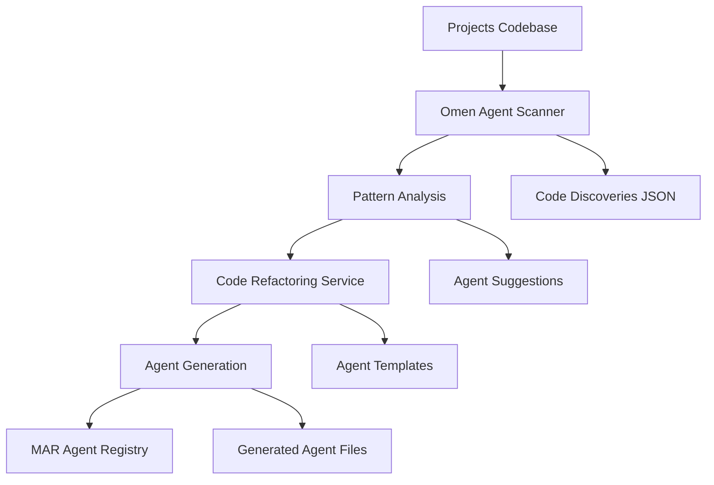

# MAR Agent Generation System

## 🌟 Overview

The MAR (Multilateral Agentic Repo) Agent Generation System is an **automated agent creation pipeline** that scans your codebase, identifies reusable patterns, and generates AI agents from existing code. This implements your vision of having the system constantly scan `/Projects/` folder and create agents by refactoring and modifying existing code.

## 🔄 Complete Workflow



## 🏗️ System Architecture

### Core Components

1. **Omen Agent** (`admin/omen_agent.py`)
   - Scans entire `/Projects/` directory
   - Uses AST parsing to extract functions and classes
   - LLM-powered analysis for agent potential
   - Pattern recognition and filtering

2. **Code Refactoring Service** (`admin/code_refactoring_service.py`)
   - Converts discovered patterns into agent blueprints
   - Generates complete agent code from templates
   - Handles dependency management and integration

3. **Agent Generation Orchestrator** (`admin/agent_generation_orchestrator.py`)
   - Coordinates the full pipeline
   - Manages session state and results
   - Provides CLI and programmatic interfaces

### Generated Agent Structure

Each generated agent follows this template:
```python
class GeneratedAgent:
    def __init__(self, config=None):
        self.memory = MemoryManager()
        self.prompt_template = load_prompt("agent_prompt.txt")
        
    def process(self, input_data) -> output_data:
        # Extracted and refactored core logic
        # LLM integration for complex decisions
        # Structured output formatting
        
    def run(self, input_data):
        # Full workflow with memory storage
```

## 🚀 Quick Start

### 1. Basic Discovery (No Generation)
```python
from admin.agent_generation_orchestrator import AgentGenerationOrchestrator

orchestrator = AgentGenerationOrchestrator()
results = orchestrator.run_full_pipeline(auto_generate=False)

print(f"Found {len(results['suggestions'])} agent suggestions")
```

### 2. Auto-Generate Agents
```python
# Generate up to 3 agents automatically
results = orchestrator.run_full_pipeline(
    auto_generate=True, 
    max_agents=3
)
```

### 3. Generate Specific Agent
```python
blueprint = orchestrator.generate_specific_agent(
    agent_name="document_processor",
    functionality_types=["processor", "extractor"]
)
```

### 4. Run Demo
```bash
cd MAR-Multilateral Agentic Repo
python demo_agent_generation.py

# Interactive mode
python demo_agent_generation.py --interactive
```

## 🔍 Discovery Process

### Pattern Recognition
The Omen Agent looks for these patterns:
- `def.*process.*(`
- `def.*extract.*(`
- `def.*analyze.*(`
- `def.*search.*(`
- `def.*validate.*(`
- `class.*Agent.*(`
- `class.*Engine.*(`
- `class.*Processor.*(`

### LLM Analysis
Each discovered code pattern is analyzed for:
- **Functionality Type**: processor, analyzer, extractor, validator, etc.
- **Input/Output Signatures**: Data types and structures
- **Dependencies**: Required libraries and modules
- **Complexity Score**: 0.0-1.0 complexity rating
- **Reusability Score**: 0.0-1.0 reusability potential
- **Agent Potential**: high, medium, low rating

## 🤖 Agent Categories

Generated agents are categorized by functionality:

- **Data Processors**: Transform and manipulate data
- **Analyzers**: Analyze patterns and extract insights
- **Extractors**: Extract structured data from unstructured sources
- **Validators**: Validate data quality and compliance
- **Searchers**: Search and discovery functionality
- **Transformers**: Convert between data formats
- **Utilities**: General-purpose helper functions

## 📁 File Structure

```
MAR-Multilateral Agentic Repo/
├── admin/
│   ├── omen_agent.py                    # Core scanner
│   ├── code_refactoring_service.py      # Agent generator
│   ├── agent_generation_orchestrator.py # Pipeline coordinator
│   └── generation_session_*.json        # Session logs
├── agents/
│   ├── data/                           # Generated data agents
│   ├── analysis/                       # Generated analysis agents
│   ├── extraction/                     # Generated extraction agents
│   └── assets/                         # Copied source files
├── shared/
│   ├── memory/
│   │   └── memory_manager.py           # Memory management
│   ├── prompts/
│   │   ├── loader.py                   # Prompt loader
│   │   └── *.txt                       # Agent prompts
│   └── configs/
├── llm/
│   └── llm_service.py                  # LLM API handling
├── configs/
│   └── agent_registry.json             # Agent registry
└── demo_agent_generation.py            # Demo script
```

## ⚙️ Configuration

### Environment Variables
```bash
# Optional - for real LLM integration
OPENAI_API_KEY=your_openai_key
ANTHROPIC_API_KEY=your_anthropic_key

# Optional - for advanced features
GOOGLE_API_KEY=your_google_key
GOOGLE_CSE_ID=your_cse_id
```

### Agent Registry Format
```json
{
  "name": "document_processor_agent",
  "category": "data",
  "smart": true,
  "compatible_llms": ["gpt-4o", "claude-3"],
  "protocols": ["MCP", "SCIP"],
  "functionality": "Process and analyze documents",
  "generated_from": ["path/to/source.py"],
  "created_at": "2025-01-XX"
}
```

## 🎯 Example Use Cases

### From Your Existing Codebases

1. **Rank_AI → Search Agents**
   - `ai_search_engine.py` → `esg_search_agent`
   - `ai_kpi_extractor.py` → `kpi_extraction_agent`

2. **Nyxion → Data Agents**
   - API models → `data_validation_agent`
   - Authentication → `auth_processing_agent`

3. **Orion → Orchestration Agents**
   - Base agents → `workflow_coordination_agent`
   - Task schedulers → `task_management_agent`

## 🔧 Customization

### Custom Agent Templates
Add new templates to `code_refactoring_service.py`:
```python
"custom_agent": '''
class {agent_class_name}:
    # Your custom template logic
'''
```

### Custom Pattern Recognition
Add patterns to Omen Agent:
```python
self.patterns_of_interest = [
    r'def.*custom_pattern.*\(',
    r'class.*CustomType.*\(',
]
```

## 🚦 Integration with MAR Methodology

The agent generation system follows MAR principles:

- **M**ultilateral Analysis: Comprehensive pattern analysis across codebase
- **A**gentic Resolution: Single-purpose, focused agent generation
- **R**epository Integration: Clean integration with existing MAR structure

## 🔄 Continuous Operation

For continuous scanning and agent generation:

```python
import schedule
import time

def continuous_agent_generation():
    orchestrator = AgentGenerationOrchestrator()
    results = orchestrator.run_full_pipeline(auto_generate=True, max_agents=2)
    return results

# Run every 6 hours
schedule.every(6).hours.do(continuous_agent_generation)

while True:
    schedule.run_pending()
    time.sleep(3600)  # Check every hour
```

## 📊 Monitoring & Logging

Session results are automatically saved to:
- `admin/generation_session_YYYYMMDD_HHMMSS.json`
- `admin/code_discoveries.json`
- `shared/memory/interactions.json`

## 🎮 Interactive Demo

Run the interactive demo to explore the system:

```bash
python demo_agent_generation.py --interactive
```

This provides a menu-driven interface to:
1. Run full discovery pipeline
2. List available patterns
3. Generate specific agents
4. View session results

## 🔮 Future Enhancements

- **Real-time monitoring** of codebase changes
- **Agent performance metrics** and optimization
- **Cross-agent collaboration** patterns
- **Web UI dashboard** for agent management
- **Version control integration** for agent evolution
- **Automated testing** of generated agents

---

**The MAR Agent Generation System transforms your existing codebase into a self-evolving agent ecosystem.** 🚀


